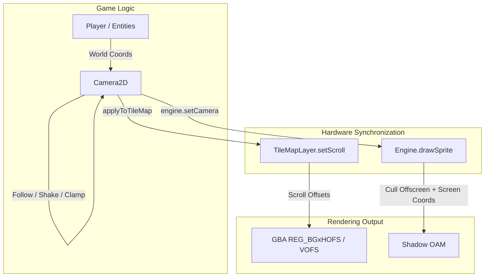

# 2D Camera, Viewport Management & TileMap Scrolling

This document outlines the architecture, mathematical specifications, and engine integration for the 2D Camera subsystem (`zamgba.engine.Camera2D`) in ZamGBA.

---

## 1. Core Motivation & GBA Hardware Realities

### 1.1 Resolution vs. World Space
* **GBA Native Resolution**: The GBA screen is fixed at $240 \times 160$ pixels.
* **Large Worlds**: Game worlds (tilemaps and entity layouts) frequently span dimensions much larger than $240 \times 160$ (e.g. $512 \times 512$, $1024 \times 1024$, or streaming worlds).
* **Coordinate Systems**:
  * **World Space**: High-precision `Fixed24_8` sub-pixel coordinates where game entities, physics, and collisions reside.
  * **Screen / Viewport Space**: Integer pixel coordinates $(0 \le x < 240, 0 \le y < 160)$ representing what is actively projected onto the GBA LCD.
  * **Hardware Scroll Registers**: GBA Background hardware registers (`REG_BGxHOFS`, `REG_BGxVOFS`) accept 9-bit integer offsets $(0..511)$ to scroll hardware background layers.
  * **Hardware Sprite Registers (OAM)**: GBA Object Attributes accept an 8-bit Y coordinate $(0..255)$ in `attr0` and a 9-bit X coordinate $(0..511)$ in `attr1`.

### 1.2 Viewport Culling and OAM Preservation
* The GBA hardware has strictly **128 OAM sprite slots**.
* In a large world containing hundreds of enemies, projectiles, items, and NPCs, staging offscreen sprites into `shadow_oam` wastes hardware slots and causes visual popping or wrap-around glitches (since GBA coordinate wrap-around maps $512 \to 0$ and $256 \to 0$).
* The Camera subsystem performs **automatic Viewport Culling** inside `engine.drawSprite(spr)`: offscreen sprites are discarded before staging into OAM.

---

## 2. Architectural Design



### 2.1 Coordinate Transformations
For a camera positioned at top-left world coordinates $(C_x, C_y)$ with screen shake offset $(S_x, S_y)$:
$$\text{Effective Camera Position: } X_c = C_x + S_x, \quad Y_c = C_y + S_y$$

* **World to Screen**:
  $$\text{screen\_x} = \text{world\_x} - \lfloor X_c \rfloor$$
  $$\text{screen\_y} = \text{world\_y} - \lfloor Y_c \rfloor$$

* **Screen to World**:
  $$\text{world\_x} = \text{screen\_x} + X_c$$
  $$\text{world\_y} = \text{screen\_y} + Y_c$$

---

## 3. Data Structures & API Specification

### 3.1 `CameraLimits`
Defines optional world-space bounding constraints:
```zig
pub const CameraLimits = struct {
    min_x: ?Fixed24_8 = null,
    min_y: ?Fixed24_8 = null,
    max_x: ?Fixed24_8 = null,
    max_y: ?Fixed24_8 = null,
};
```

### 3.2 `Deadzone`
Defines a rectangular zone around the camera center where target movement does not cause the camera to scroll:
```zig
pub const Deadzone = struct {
    width: u16,
    height: u16,
};
```

### 3.3 `Camera2D`
```zig
pub const Camera2D = struct {
    /// Top-left world coordinate of the camera viewport.
    x: Fixed24_8 = Fixed24_8.zero,
    y: Fixed24_8 = Fixed24_8.zero,

    /// Target position for smooth interpolation (lerping).
    target_x: Fixed24_8 = Fixed24_8.zero,
    target_y: Fixed24_8 = Fixed24_8.zero,

    /// Viewport dimensions in pixels (default: 240x160 GBA resolution).
    viewport_width: u16 = 240,
    viewport_height: u16 = 160,

    /// World boundary limits.
    limits: CameraLimits = .{},

    /// Target tracking deadzone.
    deadzone: ?Deadzone = null,

    /// Smoothing speed for position interpolation. 0 = instant snap.
    smooth_speed: Fixed24_8 = Fixed24_8.zero,

    /// Screen shake parameters.
    shake_intensity: Fixed24_8 = Fixed24_8.zero,
    shake_decay: Fixed24_8 = Fixed24_8.fromFloat(0.9),
    shake_offset_x: Fixed24_8 = Fixed24_8.zero,
    shake_offset_y: Fixed24_8 = Fixed24_8.zero,

    pub fn init(x: Fixed24_8, y: Fixed24_8) Camera2D;
    pub fn worldToScreen(self: *const Camera2D, wx: Fixed24_8, wy: Fixed24_8) Point2;
    pub fn screenToWorld(self: *const Camera2D, sx: i32, sy: i32) Point2;
    pub fn getVisibleAABB(self: *const Camera2D) AABB;
    pub fn isAABBVisible(self: *const Camera2D, aabb: AABB) bool;
    pub fn centerOn(self: *Camera2D, target_x: Fixed24_8, target_y: Fixed24_8) void;
    pub fn lookAt(self: *Camera2D, target_x: Fixed24_8, target_y: Fixed24_8) void;
    pub fn follow(self: *Camera2D, target: AABB) void;
    pub fn shake(self: *Camera2D, intensity: Fixed24_8, decay: ?Fixed24_8) void;
    pub fn update(self: *Camera2D) void;
    pub fn applyToTileMap(self: *const Camera2D, layer: *TileMapLayer) void;
    pub fn applyToTileMapWithParallax(self: *const Camera2D, layer: *TileMapLayer, factor_x: Fixed24_8, factor_y: Fixed24_8) void;
};
```

---

## 4. Engine & Rendering Integration

### 4.1 Global Camera Registration
`Engine` exposes `engine.setCamera(?*Camera2D)` and `engine.getCamera() ?*Camera2D`.
```zig
pub var active_camera: ?*Camera2D = null;

pub fn setCamera(camera: ?*Camera2D) void {
    active_camera = camera;
}

pub fn getCamera() ?*Camera2D {
    return active_camera;
}
```

### 4.2 Transparent Viewport Culling & Coordinate Mapping
When `engine.drawSprite(spr)` is invoked:
1. If `active_camera` is non-null:
   - Extract the sprite's world `AABB`.
   - Perform AABB-vs-Viewport overlap check (`cam.isAABBVisible(aabb)`). If not visible, return immediately without consuming an OAM slot.
   - Transform world position $(X_w, Y_w) \to (X_s, Y_s)$ via `cam.worldToScreen(X_w, Y_w)`.
   - Update OAM `attr0` (Y screen position) and `attr1` (X screen position) while preserving all shape, size, flip, and palette attributes.
2. If `active_camera` is null:
   - Fall back to legacy Mode 3 / fixed-screen behavior (compile OAM directly from sprite coordinates).

---

## 5. Parallax Scrolling & Background Mapping

A game can have multiple background layers scrolling at different speeds (e.g. Foreground, Playfield, Distant Mountains):
```zig
// In tick():
camera.follow(player.sprite.aabb);
camera.update();

// Layer 0: Main playfield (1:1 scroll speed)
camera.applyToTileMap(&main_layer);

// Layer 1: Distant background (0.5x horizontal parallax speed)
camera.applyToTileMapWithParallax(&bg_layer, Fixed24_8.fromFloat(0.5), Fixed24_8.zero);
```

---

## 6. Unit Testing Strategy (`CAM001` - `CAM008`)

All unit tests run on host (`zig build test`) and verify purely logical transformations:
* **CAM001**: Default initialization, viewport dimensions ($240 \times 160$).
* **CAM002**: Coordinate transformations (`worldToScreen` & `screenToWorld`).
* **CAM003**: Viewport AABB computation & sprite culling verification.
* **CAM004**: Boundary clamping via `CameraLimits`.
* **CAM005**: Target centering & deadzone tracking.
* **CAM006**: Position smoothing (lerp) & screen shake decay.
* **CAM007**: Background tilemap scroll sync & parallax scaling.
* **CAM008**: Engine integration: `setCamera`, coordinate translation during `drawSprite`, and off-screen OAM culling.
