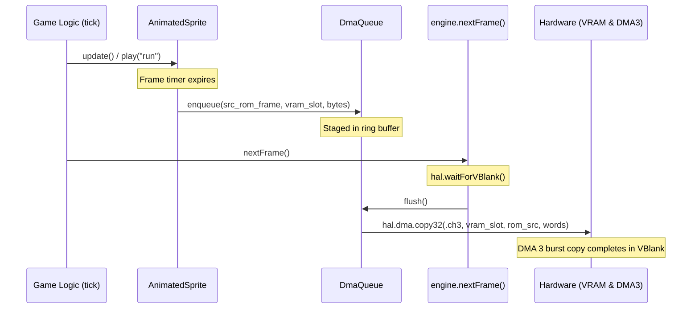

# VBlank DMA Queue & Streaming Pipeline

This document details the design, hardware constraints, and implementation of the **Fixed Ring-Buffer DMA Queue** (`src/engine/dma_queue.zig`) in Zamgba.

---

## 1. The Core Problem: Time-Shifted Memory Staging

In Game Boy Advance development, rendering and memory access are governed by strict hardware timing:

```
┌────────────────────────────────────────────────────────────┐
│ 1. Game Logic Phase (HDraw: Scanlines 0..159, ~11.6 ms)    │
│    - Game pad input, physics updates, animation advancement│
│    - Player switches to "jump", Boss switches to "slash"   │
│    - Writing to VRAM is STRICTLY FORBIDDEN (causes tearing)│
│    - Action: Animation entities enqueue transfer requests  │
└─────────────────────────────┬──────────────────────────────┘
                              │ Staged in DmaQueue
┌─────────────────────────────▼──────────────────────────────┐
│ 2. VBlank Phase (Scanlines 160..227, ~5.0 ms / 83,776 cyc) │
│    - engine.nextFrame() triggers during vertical blanking  │
│    - The ONLY safe window for high-speed VRAM tile writes  │
│    - Action: Engine flushes all queued tasks via DMA 3     │
└────────────────────────────────────────────────────────────┘
```

`DmaQueue` serves as the asynchronous staging buffer bridging the **Game Logic Phase** (where requests are created) and the **VBlank Phase** (where transfers physically execute).

---

## 2. Why a Fixed Ring Buffer (Circular Queue)?

1. **Zero-Heap Allocation (`.bss` Static Storage)**:
   - Allocates a static array of fixed tasks (e.g., `[16]DmaTask`, taking $< 256$ bytes).
   - Enqueue and flush operations simply manipulate integer indices (`head`, `tail`, `count`), taking only 1–2 CPU cycles per task.
2. **Multi-Entity Decoupling**:
   - Independent game objects (Player, Boss, projectile VFX) advance their animation frames in `tick()` without knowledge of each other. Each entity pushes its frame tile copy task into `DmaQueue.enqueue()`.
3. **Batch Coalescing & VBlank Flush**:
   - In `engine.nextFrame()`, the engine pulls all pending tasks and drives hardware DMA 3 in a tight loop during the vertical blanking interrupt.

---

## 3. Data Structures (`src/engine/dma_queue.zig`)

```zig
pub const DmaQueue = struct {
    pub const CAPACITY: usize = 16;
    pub const MAX_BYTES_PER_VBLANK: usize = 4096; // 4 KB safe VBlank budget

    tasks: [CAPACITY]hal.dma.DmaTask = undefined,
    head: usize = 0,
    tail: usize = 0,
    count: usize = 0,
    staged_bytes: usize = 0,

    /// Enqueues a DMA memory transfer task.
    pub fn enqueue(self: *DmaQueue, task: hal.dma.DmaTask) DmaQueueError!void;

    /// Flushes all queued tasks via DMA 3 and resets the queue for the next frame.
    pub fn flush(self: *DmaQueue) void;

    /// Clears any pending transfers without executing them.
    pub fn clear(self: *DmaQueue) void;
};
```

---

## 4. VBlank Bandwidth Budget Guard

* **The Hardware Redline**: The GBA VBlank window is **83,776 CPU cycles**.
* **DMA 3 Transfer Rate**: ~2 cycles per 32-bit word.
* **Safety Margin**: A 4 KB transfer (~1024 words) takes ~2,048 cycles ($< 2.5\%$ of the VBlank window), leaving ample headroom for shadow OAM copying and BIOS interrupt overhead.
* **Overload Protection**: If multiple large sprites trigger animation frame changes simultaneously such that `staged_bytes > MAX_BYTES_PER_VBLANK`, the queue safely defers non-critical background/effect transfers to the next frame, completely preventing visual tearing and emulator lockups.

---

## 5. Integration with AnimatedSprite & Engine Loop


